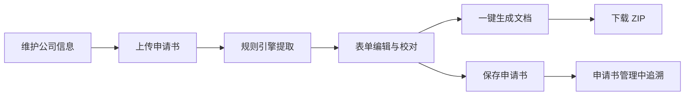

# 证书管理系统 · 用户操作手册

> 适用版本：v1.2.0 及以上  
> 适用对象：证书业务人员、文档管理员、审核人员  
> 最后更新：2026-04-28

---

## 目录

- [1. 系统简介](#1-系统简介)
- [2. 访问系统](#2-访问系统)
- [3. 系统总览](#3-系统总览)
- [4. 模块一：文档处理（智能证书生成）](#4-模块一文档处理证书生成)
- [5. 模块二：申请书管理](#5-模块二申请书管理)
- [6. 模块三：公司管理](#6-模块三公司管理)
- [7. 生成的文档类型说明](#7-生成的文档类型说明)
- [8. 数据字段参考](#8-数据字段参考)
- [9. 常见问题（FAQ）](#9-常见问题faq)
- [10. 使用建议与最佳实践](#10-使用建议与最佳实践)
- [附录 A：浏览器支持列表](#附录-a浏览器支持列表)
- [附录 B：键盘与鼠标操作约定](#附录-b键盘与鼠标操作约定)

---

## 1. 系统简介

**证书管理系统（CertAutofill）** 是一款面向汽车玻璃产品认证业务的文档自动化平台。用户只需上传申请书，系统即可通过内置的**规则引擎（基于正则表达式匹配）**自动识别并提取关键信息，随后一键生成 IF、CERT、RCS、TR、TM、OTHER 等全套合规文档，支持 DOCX 与 PDF 两种格式，并可打包批量下载。

### 1.1 核心能力

| 能力 | 说明 |
|------|------|
| 📤 **文件上传** | 支持 `.doc` / `.docx` / `.pdf` 格式的申请书文档上传 |
| 🧩 **规则引擎提取** | 基于正则表达式规则，自动提取企业、产品、技术、车辆等 40+ 字段 |
| ✏️ **表单编辑** | 提取后所有字段可在线编辑、校对、补充 |
| 🏢 **公司复用** | 历史公司信息一键填充，避免重复录入 |
| 📄 **一键生成** | 同时生成 6 种正式文档，支持 DOCX / PDF 双格式 |
| 📦 **批量下载** | 所有生成文档自动打包为 ZIP 一次性下载 |
| 🗂️ **历史追溯** | 每份申请书全量留档，可检索、查看、继续编辑 |

### 1.2 典型用户角色

- **业务申请员**：录入/上传申请书，生成交付文档
- **数据维护员**：维护公司基础信息、商标、设备档案
- **审核人员**：查看历史申请书与生成记录

---

## 2. 访问系统

### 2.1 系统地址

| 环境 | 访问地址 |
|------|---------|
| 开发环境 | `http://localhost:80` |
| 生产环境 | `http://<服务器IP>` 或 `http://<部署域名>` |

> 具体地址请咨询系统管理员。

### 2.2 登录说明

当前版本**不强制登录**，打开浏览器直接访问系统地址即可进入主页面。如管理员启用了访问控制，请使用分配给您的账号登录。

### 2.3 推荐浏览器

- ✅ **Google Chrome 90+**（推荐）
- ✅ **Microsoft Edge 90+**
- ✅ **Firefox 88+**
- ✅ **Safari 14+**
- ❌ 不支持 IE 11 及以下

---

## 3. 系统总览

### 3.1 界面结构

```
┌────────────────────────────────────────────────────────┐
│  证书管理系统     [文档处理] [申请书管理] [公司管理]    │  ← 顶部导航栏
├────────────────────────────────────────────────────────┤
│                                                        │
│              当前模块的工作区域                         │
│                                                        │
└────────────────────────────────────────────────────────┘
```

### 3.2 三大功能模块

| 菜单项 | 路径 | 用途 |
|--------|------|------|
| **文档处理** | `/` | 上传申请书 → 规则引擎提取 → 表单编辑 → 一键生成证书 |
| **申请书管理** | `/applications` | 查看、搜索、编辑、删除历史申请书 |
| **公司管理** | `/companies` | 维护企业信息、商标图案、设备档案 |

### 3.3 标准操作流程（业务主线）



---

## 4. 模块一：文档处理（智能证书生成）

这是系统的**核心功能页**，对应首页 `/`。完整流程分四步：**上传 → 提取 → 确认 → 生成**。

> 📌 **提取原理说明**：系统采用**规则引擎方式**实现，内部通过一组预先维护的**正则表达式**在申请书文本中匹配企业名称、技术参数、车辆信息等字段。

### 4.1 步骤一：上传文档

进入 **"文档处理"** 页面后，您会看到两个上传区域：

| 上传区 | 说明 | 是否必选 |
|--------|------|---------|
| 📄 **申请书文件** | 企业提交的产品认证申请书 | ✅ 必选 |
| 📊 **检测报告文件** | 第三方实验室检测报告（功能开发中） | ⏳ 暂不开放 |

#### 操作方式

1. **方式一：拖拽上传** —— 将文件直接拖入虚线框内
2. **方式二：点击选择** —— 点击上传框，在弹出的文件浏览器中选择文件

#### 文件要求

- ✅ 支持格式：`.doc` / `.docx` / `.pdf`
- ✅ 单个文件大小：不超过 **16 MB**
- ❌ 不支持加密、受保护的文档
- ❌ 不支持扫描件（系统需要文字可提取）

### 4.2 步骤二：规则引擎提取

上传完成后，点击下方的 **【提取信息】** 按钮。

#### 提取过程

- 系统后台会读取文档文本（自动剔除隐藏文字、删除线内容），然后依照内置的**正则表达式规则**逐字段匹配
- 页面会显示加载动画，通常需要 **2~10 秒**（视文件大小而定）
- 提取完成后，自动进入下一步

> ⚠️ **注意**：规则引擎依赖申请书内容的**格式规范性**。若关键段落被合并单元格、图片化或严重自定义排版，可能导致字段匹配不到。此时请直接进入下一步手动录入即可。

### 4.3 步骤三：信息确认与编辑

这是保证文档质量最关键的一步。系统按逻辑将提取到的信息分成若干区块展示。您需要**逐项核对**，并对缺失或错误的字段进行编辑。

#### 4.3.1 基础认证信息

| 字段 | 含义 | 备注 |
|------|------|------|
| 玻璃类型 (Glass Type) | 产品的玻璃类别 | 下拉选择 |
| 批准日期 (Approval Date) | 认证批准日期 | 日期选择器 |
| 测试日期 (Test Date) | 实验室测试日期 | 日期选择器 |
| 报告日期 (Report Date) | 报告出具日期 | 日期选择器 |
| 批准编号 (Approval No) | 认证编号 | 文本 |
| 报告编号 (Report No) | 检测报告编号 | 文本 |
| 信息文件编号 (Information Folder No) | IF 文档编号 | 文本 |
| 安全等级 (Safety Class) | 产品安全分类 | 下拉选择 |
| 产品描述 (Pane Desc) | 玻璃片描述 | 多行文本 |

#### 4.3.2 企业信息

| 字段 | 操作说明 |
|------|---------|
| **公司** | 从下拉框选择，若不存在可点击"**新增公司**"按钮快速创建 |
| 公司地址 | 选择公司后自动带入，可手动修改 |

> 💡 **小技巧**：所有已在"公司管理"模块中维护过的企业，都会出现在下拉列表中，无需重复输入。

#### 4.3.3 技术参数

包含玻璃物理参数（厚度、层数、夹层类型等）、涂层信息、材料特性等，全部支持数值/文本/下拉编辑。

关键字段示例：

- 风窗厚度 Windscreen Thickness
- 夹层厚度 Interlayer Thickness
- 玻璃层数 Glass Layers
- 夹层数 Interlayer Layers
- 涂层类型 / 厚度 / 颜色
- 玻璃处理 / 夹层类型 / 材料性质

#### 4.3.4 车辆信息（可多辆）

每一辆适用车辆均有独立的卡片，可以通过右上角 **➕ 添加车辆** / **🗑 删除车辆** 按钮进行管理。

每辆车包含的字段：

- 制造商、类型、类别、开发区域
- 段高度、曲率半径、安装角度、座椅角度
- 参考点坐标（A / B / C 三组）
- 开发描述（多行文本）

> 💡 **支持批量**：一份申请书中可登记多辆车，系统会在生成文档时为每辆车生成对应章节。

#### 4.3.5 商标与设备信息

- **商标名称列表**：多个商标名以 Tag 标签形式添加
- **商标图片**：上传商标图案（jpg / png）
- **设备信息**：关联"公司管理"中的设备档案

#### 4.3.6 备注

其他不属于上述字段的文字说明，可写在 **备注（Remarks）** 中。

### 4.4 步骤四：生成与下载文档

信息确认无误后，页面下方会提供两类操作按钮：

#### 💾 保存申请书

点击 **【保存申请书】**，系统会将所有表单数据写入数据库，并在"申请书管理"中生成一条记录。**建议在生成文档前先保存**，以防数据丢失。

#### 📄 生成文档

系统支持两种生成模式：

##### 模式 A：一键生成全部文档（推荐）

点击 **【生成所有文档】**，系统将同时生成以下 6 种文档，并打包成一个 ZIP：

| 缩写 | 全名 | 用途 |
|------|------|------|
| **IF** | Information Folder | 信息文件 |
| **CERT** | Certificate | 正式证书 |
| **RCS** | Review Control Sheet | 审查控制表 |
| **TR** | Test Report | 测试报告 |
| **TM** | Technical Memo | 技术备忘录 |
| **OTHER** | Other Documents | 其他附属文档 |

生成完成后，浏览器会自动提示下载 `.zip` 压缩包。

##### 模式 B：单独生成某类文档

若只需要其中一种，点击对应按钮即可：

- 【生成 IF】
- 【生成证书】
- 【生成技术报告】
- 【生成技术备忘录】
- 【生成审查控制表】
- 【生成其他文档】

#### 📑 输出格式选择

在生成按钮旁的 **格式切换** 可选择：

- 📄 **DOCX**（默认）：可继续编辑的 Word 文档
- 📕 **PDF**：最终交付格式，依赖后端 Microsoft Word 转换

> ⚠️ **PDF 生成须知**：服务器端需已安装 Microsoft Word，若提示"PDF 生成失败"，请联系管理员检查服务器环境。

---

## 5. 模块二：申请书管理

入口：顶部导航栏点击 **【申请书管理】**，或访问 `/applications`。

### 5.1 页面功能一览

| 区域 | 功能 |
|------|------|
| 🔍 顶部搜索栏 | 按编号、企业名、产品名等关键字搜索 |
| 📋 申请书列表 | 分页展示所有已保存的申请书 |
| ⚙️ 操作按钮 | 查看 / 编辑 / 删除 / 再次生成 |

### 5.2 查看申请书详情

1. 在列表中点击任意一条记录的 **【查看】** 按钮
2. 系统会跳转到"文档处理"页面，自动回填该申请书的所有字段
3. 您可以直接基于这份数据进行编辑或重新生成文档

### 5.3 编辑申请书

- 从列表点击 **【编辑】**，可直接修改该申请书
- 编辑完成后点击 **【保存申请书】**，更新数据库

### 5.4 删除申请书

- 点击 **【删除】**，会弹出二次确认对话框
- 确认后该条记录将**永久删除**，不可恢复

> ⚠️ **重要提示**：删除操作不可逆，请谨慎操作。如需保留数据，请导出或备份数据库（见部署文档）。

### 5.5 搜索与分页

- **搜索**：输入关键字后按回车或点击🔍图标
- **分页**：列表底部可翻页，每页默认 10 条
- **排序**：点击列头可按时间、编号排序

---

## 6. 模块三：公司管理

入口：顶部导航栏点击 **【公司管理】**，或访问 `/companies`。

> 💡 公司管理是"文档处理"的**数据基础**。建议业务开展前先维护好常用公司档案。

### 6.1 页面结构

```
┌─ 搜索栏 + 新增按钮 ─────────────────────┐
│                                        │
├─ 公司列表（卡片式）────────────────────┤
│  ┌─────────┐ ┌─────────┐ ┌─────────┐  │
│  │  A 公司  │ │  B 公司  │ │  C 公司  │  │
│  │ 编辑 删除│ │ 编辑 删除│ │ 编辑 删除│  │
│  └─────────┘ └─────────┘ └─────────┘  │
└────────────────────────────────────────┘
```

### 6.2 新增公司

1. 点击页面右上角 **【➕ 新增公司】**
2. 在弹出的表单中填写以下信息：

| 分类 | 字段 |
|------|------|
| **基本信息** | 公司名称（中文）、公司英文名、公司地址、联系电话、邮箱 |
| **商标信息** | 商标名称列表（多个）、商标图案（图片上传） |
| **设备信息** | 实验室/生产设备名称、型号、编号等 |
| **其他** | 备注说明 |

3. 点击 **【保存】**，新公司即加入列表

### 6.3 编辑公司

- 在公司卡片点击 **【编辑】**
- 修改任意字段后点击 **【保存】**
- 已关联该公司的历史申请书**不会受影响**（数据已在生成时固化）

### 6.4 删除公司

- 点击 **【删除】**
- 二次确认后删除

> ⚠️ 若该公司已被申请书引用，系统会提示并阻止删除。如必须删除，请先到"申请书管理"中删除相关申请书。

### 6.5 上传商标图案

- 在公司编辑页点击 **【上传商标】**
- 支持 `.png` / `.jpg` / `.jpeg`，建议尺寸 **≤ 500×500 像素**，文件 **≤ 2 MB**
- 上传后可直接在页面预览

### 6.6 设备信息管理

设备信息用于生成 TR（测试报告）文档中的"实验设备"章节。

- 点击 **【添加设备】** 新增一行
- 填写设备名称、型号、编号、校准日期等
- 点击行尾 🗑 图标可删除

---

## 7. 生成的文档类型说明

系统基于 `backend/templates/` 中的模板生成以下文档：

| 文件名前缀 | 类型 | 来源模板 | 典型内容 |
|-----------|------|---------|---------|
| `IF_*.docx` | 信息文件 | `IF_Template.docx` | 完整产品技术档案 |
| `CERT_*.docx` | 证书 | `CERT_Template.docx` | 正式认证证书 |
| `RCS_*.docx` | 审查控制表 | `Review Control Sheet V7_Template.docx` | 内部审查流程表 |
| `TR_*.docx` | 测试报告 | `TR_Template.docx` | 实验室测试数据 |
| `TM_*.docx` | 技术备忘录 | `TM_Template.docx` | 关键技术说明 |
| `OTHER_*.docx` | 其他文档 | `OTHER_Template.docx` | 附属文件 |

生成的文件保存在服务器 `backend/uploads/generated_files/` 目录下，**浏览器端会直接触发下载**，您无需关心服务器文件位置。

---

## 8. 数据字段参考

### 8.1 企业信息

| 字段 Key | 中文名 | 类型 |
|---------|--------|------|
| company_name | 企业名称 | 字符串 |
| company_en_name | 企业英文名 | 字符串 |
| company_address | 企业地址 | 字符串 |

### 8.2 技术参数

| 字段 Key | 中文名 | 类型 |
|---------|--------|------|
| windscreen_thick | 风窗厚度 | 数值（mm） |
| interlayer_thick | 夹层厚度 | 数值（mm） |
| glass_layers | 玻璃层数 | 整数 |
| interlayer_layers | 夹层数 | 整数 |
| interlayer_type | 夹层类型 | 字符串 |
| glass_treatment | 玻璃处理 | 字符串 |
| coating_type | 涂层类型 | 字符串 |
| coating_thick | 涂层厚度 | 数值 |
| coating_color | 涂层颜色 | 字符串 |
| material_nature | 材料性质 | 字符串 |
| glass_color_choice | 玻璃颜色选择 | 字符串 |
| conductors_choice | 导体选择 | 字符串 |
| opaque_obscure_choice | 不透明/模糊选择 | 字符串 |

### 8.3 车辆信息（数组，每辆车独立）

| 字段 Key | 中文名 |
|---------|--------|
| veh_mfr | 车辆制造商 |
| veh_type | 车辆类型 |
| veh_cat | 车辆类别 |
| dev_area | 开发区域 |
| seg_height | 段高度 |
| curv_radius | 曲率半径 |
| inst_angle | 安装角度 |
| seat_angle | 座椅角度 |
| rpoint_coords.A / B / C | 参考点坐标 |
| dev_desc | 开发描述 |

### 8.4 商标与设备

| 字段 Key | 中文名 | 类型 |
|---------|--------|------|
| trade_names | 商标名称列表 | 数组 |
| trade_marks | 商标图片 | 文件列表 |
| equipment_info | 设备信息 | 数组（名称/型号/编号） |

### 8.5 系统参数

| 字段 Key | 中文名 | 说明 |
|---------|--------|------|
| version_numbers | 版本号 | 系统维护 |
| lab_parameters | 实验室参数 | 环境温度、湿度等 |
| regulation_update_date | 法规更新日期 | 参考最新法规版本 |

---

## 9. 常见问题（FAQ）

### Q1：上传文件一直失败怎么办？

**可能原因与排查：**

1. 文件 **大于 16 MB** → 压缩后重试
2. 文件 **格式不支持**（只支持 doc / docx / pdf）
3. 文件 **加密或受保护** → 解除保护后重试
4. **网络中断** → 刷新页面重试
5. 后端服务未启动 → 联系管理员检查 `http://localhost:5000/api/health`

### Q2：规则引擎提取结果不准确怎么办？

- ✅ 提取功能主要用于**省力**，而非完全替代人工
- ✅ 请逐字段核对、修改
- 💡 **提高匹配率小贴士**：
  - 尽量使用 `.docx` 格式（比 PDF 文本抽取更稳定）
  - 申请书内容应遵循**标准模板格式**，字段名、表头、标题保持规范
  - 表格数据避免合并单元格、避免用图片代替文字
  - 若公司经常有新格式导致匹配失败，可联系研发同事扩充规则库（位于 `backend/app/services/document_extract/rule_engine_strategy.py`）

### Q3：文档生成时卡住不动？

- 一般生成过程 **5~30 秒**
- 若超过 2 分钟未响应：
  1. 检查浏览器控制台是否有报错（F12 打开）
  2. 刷新页面，重新点击生成
  3. 联系管理员查看后端日志

### Q4：PDF 生成失败，提示"Word 不可用"？

- 该系统的 PDF 生成依赖**服务器端 Microsoft Word**
- 请联系管理员检查：
  1. 服务器上 Microsoft Word 是否已安装
  2. `pywin32` 依赖是否正常
  3. 详见《部署文档》的环境自检章节

### Q5：公司无法删除？

系统会阻止删除**已有申请书引用**的公司。请按以下顺序处理：

1. 到"申请书管理"，删除或转移引用该公司的申请书
2. 再回到"公司管理"删除

### Q6：数据丢失了怎么办？

- 如果系统正常运行但数据显示异常：刷新页面
- 如果数据库损坏：联系管理员使用**最近一次备份**恢复（数据库文件：`backend/instance/cert_autofill.db`）

### Q7：能否多人同时使用？

- ✅ 支持多人同时访问同一个系统
- ⚠️ 当前版本 **不做账号隔离**，所有人看到的是同一份数据
- 建议操作前互相通知，避免同时编辑同一份申请书

### Q8：浏览器页面样式错乱？

- 清除浏览器缓存后重试（Ctrl + Shift + R 强刷）
- 尝试更换浏览器（推荐 Chrome）
- 确认浏览器版本符合"推荐浏览器"要求

### Q9：生成的 ZIP 文件解压后打不开 Word？

- 确认已安装 Microsoft Word（2010 或更高版本）
- 文件名**包含中文**在部分 Windows 版本下需使用"好压 / Bandizip"等支持 UTF-8 的解压工具

### Q10：保存申请书后找不到了？

- 进入"申请书管理"模块
- 在搜索框输入**批准编号**或**企业名**过滤
- 若依然找不到，可能保存时网络中断，请重新录入

---

## 10. 使用建议与最佳实践

### 10.1 推荐工作流

1. **准备阶段**  
   → 在"公司管理"中提前录入常用企业信息与商标、设备

2. **日常操作**  
   → "文档处理" 上传 → 提取 → 核对 → **先保存再生成**

3. **数据归档**  
   → 定期联系管理员导出数据库、备份生成文件

### 10.2 提高效率的小技巧

| 技巧 | 说明 |
|------|------|
| 🧩 **模板化公司信息** | 一次录入，每次调用 |
| 📎 **保留原始申请书** | 便于溯源 |
| 💾 **分步保存** | 先保存申请书再点生成，防止数据丢失 |
| 🔍 **善用搜索** | 申请书多了可按编号/企业名快速定位 |
| 🖨 **校对再交付** | 生成的 DOCX 建议人工浏览一遍再交付客户 |

### 10.3 不建议的做法

- ❌ 在不同浏览器窗口同时编辑同一份申请书
- ❌ 大批量同时生成（建议一次 ≤ 5 份）
- ❌ 直接在服务器文件夹中手动编辑已生成文件（无法追溯）

---

## 附录 A：浏览器支持列表

| 浏览器 | 最低版本 | 推荐版本 | 备注 |
|--------|---------|---------|------|
| Chrome | 90 | 最新稳定版 | ✅ 首选 |
| Edge | 90 | 最新稳定版 | ✅ Windows 推荐 |
| Firefox | 88 | 最新稳定版 | ✅ |
| Safari | 14 | 最新稳定版 | ✅ Mac 用户 |
| Opera | 76 | 最新稳定版 | ✅ |
| IE 11 | — | — | ❌ 不支持 |

---

## 附录 B：键盘与鼠标操作约定

| 操作 | 说明 |
|------|------|
| `Tab` | 在表单字段间切换焦点 |
| `Enter` | 在搜索框中触发搜索 |
| `Esc` | 关闭弹出对话框 |
| `Ctrl + F5` | 强制刷新页面 |
| 🖱 拖拽 | 用于文件上传 |
| 🖱 悬停 | 显示字段提示信息 |

---

## 版本与联系方式

- **系统版本**：v1.2.0
- **手册版本**：1.0
- **技术支持**：请联系您所在单位的系统管理员
- **开发团队**：CertAutofill Development Team

> 本手册会随系统功能迭代持续更新，最新版本以仓库中文件为准。
