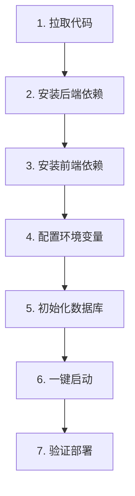

# 证书管理系统 · 部署文档

> 适用版本：v1.2.0 及以上  
> 适用对象：系统管理员、运维工程师、实施部署人员  
> 部署方案：**Windows 原生部署**（后端依赖 Microsoft Word COM 组件，不支持 Docker/Linux）  
> 最后更新：2026-04-28

---

## 目录

- [1. 部署概述](#1-部署概述)
- [2. 系统架构](#2-系统架构)
- [3. 环境要求](#3-环境要求)
- [4. 准备工作](#4-准备工作)
- [5. 部署步骤](#5-部署步骤)
- [6. 配置说明](#6-配置说明)
- [7. 启动与停止](#7-启动与停止)
- [8. 验证部署](#8-验证部署)
- [9. 端口与防火墙](#9-端口与防火墙)
- [10. 数据管理](#10-数据管理)
- [11. 日常运维](#11-日常运维)
- [12. 升级与回滚](#12-升级与回滚)
- [13. 故障排查](#13-故障排查)
- [14. 安全加固建议](#14-安全加固建议)
- [附录 A：目录结构清单](#附录-a目录结构清单)
- [附录 B：API 端点全清单](#附录-b-api-端点全清单)
- [附录 C：一键启动脚本功能说明](#附录-c一键启动脚本功能说明)

---

## 1. 部署概述

### 1.1 本系统简介

**证书管理系统（CertAutofill）** 采用前后端分离架构：

- **前端**：Vue 3 + TypeScript + Element Plus + Vite
- **后端**：Python Flask + SQLAlchemy + SQLite
- **文档生成**：python-docx + docxtpl + Microsoft Word COM（pywin32）
- **文档提取**：基于正则表达式的**规则引擎**

### 1.2 部署方案说明

⚠️ **重要：本系统仅支持 Windows 原生部署**

| 方案 | 是否可行 | 原因 |
|------|---------|------|
| ✅ **Windows 原生部署** | 可行 | 后端依赖 Microsoft Word COM，需本地 Word |
| ❌ Docker 部署 | 不可行 | Word COM 无法在容器中运行 |
| ❌ Linux 部署 | 不可行 | Linux 无 Word COM 组件 |
| ❌ macOS 部署 | 不可行 | 同上 |

### 1.3 部署拓扑

```
┌─────────────────────────────────────────────────┐
│         Windows Server / Windows 10/11          │
│                                                 │
│  ┌──────────┐     ┌──────────────┐              │
│  │ 前端 Web │◀───▶│  Flask 后端  │              │
│  │ (Vite)   │     │  (port 5000) │              │
│  │ (port 80)│     └──────┬───────┘              │
│  └──────────┘            │                      │
│       ▲                  ▼                      │
│       │           ┌────────────┐                │
│       │           │   SQLite   │                │
│    浏览器          │  数据库    │                │
│                   └────────────┘                │
│                          │                      │
│                          ▼                      │
│                  ┌──────────────┐               │
│                  │  MS Word COM │               │
│                  │  (pywin32)   │               │
│                  └──────┬───────┘               │
│                          │                      │
│                          ▼                      │
│                  ┌──────────────┐               │
│                  │  规则引擎提取   │               │
│                  │  （正则本地化） │               │
│                  └──────────────┘               │
└─────────────────────────────────────────────────┘
```

---

## 2. 系统架构

### 2.1 技术栈全景

| 层级 | 技术 | 版本 |
|------|------|------|
| **前端框架** | Vue | 3.x |
| **前端语言** | TypeScript | 5.x |
| **UI 组件库** | Element Plus | 2.x |
| **构建工具** | Vite | 5.x |
| **路由** | Vue Router | 4.x |
| **HTTP 客户端** | Axios | 1.x |
| **后端框架** | Flask | 2.3.3 |
| **ORM** | SQLAlchemy | via Flask-SQLAlchemy 3.1.1 |
| **数据库** | SQLite | 内置 |
| **文档处理** | python-docx / docxtpl | 1.2.0 / 0.20.1 |
| **Word 集成** | pywin32 | 306 |
| **提取引擎** | 自研规则引擎（Python 正则匹配） | 本地 |

### 2.2 核心目录结构

```
cert_autofill/
├── backend/                           # 后端 Flask 应用
│   ├── app/
│   │   ├── api/                       # API 蓝图
│   │   │   ├── mvp_routes.py          # 主业务 API
│   │   │   ├── company_routes.py      # 公司管理 API
│   │   │   └── application_routes.py  # 申请书管理 API
│   │   ├── models/                    # 数据模型
│   │   ├── services/                  # 业务服务
│   │   │   └── generators/            # 6 种文档生成器
│   │   ├── utils/                     # 工具类
│   │   ├── config.py                  # 应用配置
│   │   └── main.py                    # Flask 工厂函数
│   ├── templates/                     # DOCX 模板（6 份）
│   ├── client/                        # 客户文件
│   ├── config/                        # 系统参数配置
│   ├── instance/                      # 数据库目录
│   │   └── cert_autofill.db           # SQLite 主数据库
│   ├── uploads/                       # 文件上传 & 生成目录
│   │   └── generated_files/           # 生成的文档输出
│   ├── requirements_clean.txt         # Python 依赖清单
│   └── run.py                         # 启动入口
│
├── frontend/                          # 前端 Vue 应用
│   ├── src/
│   │   ├── views/                     # 三大主页面
│   │   ├── components/                # 可复用组件
│   │   ├── api/                       # API 接口封装
│   │   └── router/                    # 路由配置
│   ├── package.json                   # 前端依赖清单
│   └── vite.config.ts                 # Vite 配置
│
├── nginx/                             # Nginx 配置（未来原生部署可选）
│   └── nginx.conf
│
├── env.development                    # 开发环境配置
├── env.production                     # 生产环境配置
├── start.bat                          # 一键启动脚本
├── stop.bat                           # 一键停止脚本
└── README.md                          # 项目说明
```

---

## 3. 环境要求

### 3.1 硬件要求

| 项目 | 最低配置 | 推荐配置 |
|------|---------|---------|
| CPU | 双核 2.0 GHz | 四核 3.0 GHz+ |
| 内存 | 4 GB | 8 GB+ |
| 硬盘 | 10 GB 可用 | 50 GB+ SSD |
| 网络 | 内网可达 | 100 Mbps+ |

### 3.2 操作系统

| 系统 | 是否支持 | 说明 |
|------|---------|------|
| **Windows 10** | ✅ | 1909 及以上 |
| **Windows 11** | ✅ | 推荐 |
| **Windows Server 2016** | ✅ | — |
| **Windows Server 2019** | ✅ | 推荐 |
| **Windows Server 2022** | ✅ | 推荐 |
| Linux / macOS | ❌ | 不支持（无 Word COM） |

### 3.3 必需软件

| 软件 | 版本 | 用途 | 下载地址 |
|------|------|------|---------|
| **Python** | 3.8 ~ 3.12 | 后端运行时 | https://www.python.org/downloads/windows/ |
| **Node.js** | 18.x / 20.x LTS | 前端构建 & 运行 | https://nodejs.org/ |
| **Microsoft Word** | 2016+ | DOCX → PDF 转换 | Microsoft Office |
| **Git**（可选） | 最新版 | 代码拉取 | https://git-scm.com/download/win |

### 3.4 网络与权限

- ✅ 服务器需按实际网络环境开放前后端端口（默认 80 / 5000）
- ✅ 运行账号需有 **Microsoft Word COM 调用权限**（本地管理员最稳妥）
- ✅ 开放端口（默认 80、5000）

---

## 4. 准备工作

### 4.1 安装 Python

1. 下载 Python 3.10+ 安装包（64 位）
2. **安装时务必勾选** ☑ `Add Python to PATH`
3. 打开 PowerShell / CMD 验证：

```bat
python --version
pip --version
```

### 4.2 安装 Node.js

1. 下载 Node.js 20.x LTS（含 npm）
2. 默认安装即可
3. 验证：

```bat
node --version
npm --version
```

### 4.3 确认 Microsoft Word

- 打开"开始菜单"搜索 Word，确认可打开
- 注册表确认：在 `regedit` 中查看 `HKEY_CLASSES_ROOT\Word.Application` 是否存在

### 4.4 获取项目代码

方式一：**Git 克隆**

```bat
git clone <仓库地址> cert_autofill
cd cert_autofill
```

方式二：**压缩包**  
解压到目标目录，例如：`C:\apps\cert_autofill`

> 📌 **路径建议**：避免使用含空格、中文的路径（如 `C:\Program Files`），推荐 `C:\apps\` 或 `D:\deploy\` 等纯英文路径。

---

## 5. 部署步骤

### 5.1 流程总览



### 5.2 安装后端依赖

进入 `backend/` 目录，建议使用 **Python 虚拟环境** 隔离：

```bat
cd backend
python -m venv venv
venv\Scripts\activate
pip install -r requirements_clean.txt
pip install pywin32==306
```

> ⚠️ **必装 pywin32**：`requirements_clean.txt` 中 `pywin32` 默认注释，必须**手动安装**：
> ```bat
> pip install pywin32==306
> python venv\Scripts\pywin32_postinstall.py -install
> ```

#### 后端依赖清单

```text
Flask==2.3.3
Flask-Cors==4.0.0
Flask-SQLAlchemy==3.1.1
Flask-Migrate==4.0.5
Flask-Login==0.6.3
Flask-Bcrypt==1.0.1
gunicorn==21.2.0
python-docx==1.2.0
docxtpl==0.20.1
docxcompose==1.3.6
PyPDF2==3.0.1
openpyxl==3.0.10
python-dotenv==1.0.0
requests==2.31.0
Werkzeug==2.3.7
pywin32==306           # Windows Word COM 支持
```

### 5.3 安装前端依赖

```bat
cd ..\frontend
npm install
```

国内网络建议使用国内镜像：

```bat
npm config set registry https://registry.npmmirror.com
npm install
```

### 5.4 配置环境变量

打开项目根目录的 `env.development` 或 `env.production`，按需修改：

```properties
# 环境标识
ENV=development

# 端口配置
BACKEND_PORT_DEV=5000
BACKEND_PORT_PROD=5000
FRONTEND_PORT_DEV=80
FRONTEND_PORT_PROD=80

# Flask 环境
FLASK_ENV=development
SECRET_KEY=请改为生产环境专用的强随机密钥
DATABASE_URL=sqlite:///cert_autofill.db
# 服务器展示 URL（用于后端生成下载链接）
SERVER_URL=http://localhost

# 日志级别
LOG_LEVEL=DEBUG

# 文件上传限制
MAX_FILE_SIZE=16777216
```

> 🔐 **生产环境务必修改**：
> - `SECRET_KEY` → 长度 ≥ 32 位的随机字符串
> - `FLASK_ENV=production`

### 5.5 初始化数据库

首次启动时，`app/main.py` 的 `db.create_all()` 会自动创建 SQLite 数据库和所有表。无需手动执行 SQL。

数据库文件位置：`backend/instance/cert_autofill.db`

### 5.6 准备模板文件

确认 `backend/templates/` 目录下存在以下 **6 个必备模板文件**：

```
IF_Template.docx
CERT_Template.docx
Review Control Sheet V7_Template.docx
TR_Template.docx
TM_Template.docx
OTHER_Template.docx
```

缺失任意一份都会导致对应文档无法生成。

---

## 6. 配置说明

### 6.1 环境配置文件

| 文件 | 作用域 | 说明 |
|------|-------|------|
| `env.development` | 开发环境 | `start.bat` 菜单选项 1 / 3 / 4 使用 |
| `env.production` | 生产环境 | `start.bat` 菜单选项 2 使用 |
| `frontend/.env.developpement` | 前端开发 | Vite 开发模式读取 |
| `frontend/.env.production` | 前端生产 | Vite 构建使用 |

### 6.2 关键配置项详解

| 配置项 | 默认值 | 说明 |
|-------|--------|------|
| `ENV` | `development` | 环境标识，影响端口与调试模式 |
| `BACKEND_PORT_DEV` | `5000` | 开发后端端口 |
| `BACKEND_PORT_PROD` | `5000` | 生产后端端口 |
| `FRONTEND_PORT_DEV` | `80` | 开发前端端口 |
| `FRONTEND_PORT_PROD` | `80` | 生产前端端口 |
| `FLASK_ENV` | `development` | 控制 Flask 是否 Debug |
| `SECRET_KEY` | 开发默认值 | Session / CSRF 加密密钥 |
| `DATABASE_URL` | `sqlite:///cert_autofill.db` | 数据库连接串 |
| `SERVER_URL` | `http://localhost` | 供后端生成下载链接使用 |
| `LOG_LEVEL` | `DEBUG` / `INFO` | 日志级别 |
| `MAX_FILE_SIZE` | `16777216`（16MB） | 单文件上传上限 |

### 6.3 前端环境变量

前端在 `frontend/.env.production` 中配置 API 地址：

```properties
VITE_API_BASE_URL=http://<后端地址>:5000
```

> 📌 如果前后端同机部署且前端经 Nginx 反代，则可不配或留空，使用相对路径。

### 6.4 Flask 后端配置类

位于 `backend/app/config.py`：

```python
class Config:
    SECRET_KEY = os.environ.get('SECRET_KEY') or 'dev-secret-key-change-in-production'
    SQLALCHEMY_DATABASE_URI = os.environ.get('DATABASE_URL') or 'sqlite:///cert_autofill.db'
    UPLOAD_FOLDER = ...  # 默认 backend/uploads
    MAX_CONTENT_LENGTH = 16 * 1024 * 1024   # 16MB
    PERMANENT_SESSION_LIFETIME = timedelta(hours=24)
```

三种配置派生：`DevelopmentConfig` / `ProductionConfig` / `TestingConfig`。

---

## 7. 启动与停止

### 7.1 一键启动（推荐）

在项目根目录**双击 `start.bat`**，进入交互菜单：

```
 =====================================================
    CertAutofill 一键启动 | Windows 原生方案
 =====================================================

    1) 启动开发环境   (前端 Vite 热更新 + 后端 Flask)
    2) 启动生产环境   (前端 build + preview + 后端)
    3) 仅启动后端     (python run.py)
    4) 仅启动前端     (npm run dev)
    5) 环境自检       (检查 Python/Node/Word/依赖)
    6) 停止所有服务
    0) 退出
```

| 菜单项 | 用途 | 使用场景 |
|-------|------|---------|
| **1** | 开发环境 | 开发/测试 |
| **2** | 生产环境 | 正式上线 |
| **3** | 仅后端 | 单独调试后端 |
| **4** | 仅前端 | 前端改样式 |
| **5** | 环境自检 | ✅ **首次部署必跑** |
| **6** | 停止服务 | 停掉所有相关进程 |

#### ⭐ 推荐部署流程

```
首次部署：start.bat → 5（环境自检）→ 确认全部 [OK] → 2（生产环境）
```

### 7.2 手动启动

#### 7.2.1 后端

```bat
cd backend
venv\Scripts\activate
python run.py
```

启动成功标志：

```
启动后端服务 - 环境: development, 端口: 5000, 调试模式: True
 * Running on http://0.0.0.0:5000
```

#### 7.2.2 前端（开发模式）

```bat
cd frontend
npm run dev
```

#### 7.2.3 前端（生产模式）

```bat
cd frontend
npm run build      # 生成 dist 目录
npm run preview    # 预览生产构建
```

### 7.3 停止服务

#### 方式一：一键停止

双击 `stop.bat`，或在 `start.bat` 菜单中选 **6**。

#### 方式二：手动停止

关闭对应的命令行窗口即可。如果窗口已关：

```bat
# 按端口强杀
for /f "tokens=5" %p in ('netstat -ano ^| findstr ":5000" ^| findstr LISTENING') do taskkill /PID %p /F
for /f "tokens=5" %p in ('netstat -ano ^| findstr ":80 " ^| findstr LISTENING')   do taskkill /PID %p /F
```

### 7.4 开机自启动（可选）

如需服务器开机自启，可将 `start.bat` 添加到 Windows 任务计划：

1. 打开 **任务计划程序**（`taskschd.msc`）
2. 创建基本任务 → 触发器 = "计算机启动时"
3. 操作 = "启动程序" → 浏览到 `start.bat`
4. 勾选"**以最高权限运行**"
5. 修改 `start.bat` 加入命令行参数自动选 2（需改造脚本）

> 💡 **进阶方案**：使用 [NSSM](https://nssm.cc/) 将 `python run.py` 和 `npm run preview` 注册为 Windows 服务，实现开机自启 + 异常重启。

---

## 8. 验证部署

### 8.1 后端健康检查

浏览器或 curl 访问：

```
http://localhost:5000/api/health
```

预期返回：

```json
{"status": "healthy", "database": "connected"}
```

### 8.2 前端访问

浏览器打开 `http://localhost`，应看到系统主页及顶部导航：

- 文档处理
- 申请书管理
- 公司管理

### 8.3 接口联通性测试

```bat
curl http://localhost:5000/api/companies
curl http://localhost:5000/api/applications
```

应返回 JSON 列表（即使为空也说明接口畅通）。

### 8.4 端到端功能验证

| 序号 | 验证项 | 预期 |
|------|-------|------|
| 1 | 打开首页 | 正常显示，无报错 |
| 2 | 公司管理 → 新增公司 | 保存成功 |
| 3 | 文档处理 → 上传 docx | 上传成功 |
| 4 | 点击【提取信息】 | 返回提取结果 |
| 5 | 点击【生成所有文档】 | 下载 ZIP 文件 |
| 6 | 解压 ZIP | 6 份 docx 文档齐全 |
| 7 | 切换为 PDF 生成 | 成功下载 PDF |

---

## 9. 端口与防火墙

### 9.1 默认端口

| 服务 | 端口 | 协议 | 说明 |
|------|------|------|------|
| 前端 Vite / Preview | 80 | HTTP | 浏览器访问入口 |
| 后端 Flask | 5000 | HTTP | API 服务 |

### 9.2 修改端口

编辑 `env.development` 或 `env.production`：

```properties
BACKEND_PORT_DEV=5000    # 改成需要的端口
FRONTEND_PORT_DEV=8080   # 例如避开 80 端口冲突
```

### 9.3 Windows 防火墙放行

以管理员身份打开 PowerShell：

```powershell
New-NetFirewallRule -DisplayName "CertAutofill-Frontend" -Direction Inbound -LocalPort 80 -Protocol TCP -Action Allow
New-NetFirewallRule -DisplayName "CertAutofill-Backend" -Direction Inbound -LocalPort 5000 -Protocol TCP -Action Allow
```

### 9.4 端口占用排查

```bat
netstat -ano | findstr :80
netstat -ano | findstr :5000
tasklist /FI "PID eq <PID>"
```

---

## 10. 数据管理

### 10.1 数据目录一览

| 目录 | 内容 | 重要性 |
|------|------|-------|
| `backend/instance/` | SQLite 数据库 | ⭐⭐⭐ 核心 |
| `backend/uploads/` | 用户上传文件 | ⭐⭐ 重要 |
| `backend/uploads/generated_files/` | 生成的文档 | ⭐ 可再生 |
| `backend/templates/` | 文档模板 | ⭐⭐⭐ 核心 |
| `backend/config/` | 系统参数 | ⭐⭐ 重要 |
| `backend/client/` | 客户文件 | ⭐⭐ 重要 |

### 10.2 数据备份

#### 10.2.1 手动备份（推荐）

创建 `backup.bat`：

```bat
@echo off
set DATE=%date:~0,4%%date:~5,2%%date:~8,2%
set BACKUP_DIR=D:\backup\cert_autofill_%DATE%

mkdir "%BACKUP_DIR%"
xcopy /E /I /Y "backend\instance"  "%BACKUP_DIR%\instance"
xcopy /E /I /Y "backend\uploads"   "%BACKUP_DIR%\uploads"
xcopy /E /I /Y "backend\templates" "%BACKUP_DIR%\templates"
xcopy /E /I /Y "backend\config"    "%BACKUP_DIR%\config"

echo 备份完成：%BACKUP_DIR%
pause
```

每日手动执行或加入任务计划。

#### 10.2.2 数据库单独备份

```bat
copy /Y backend\instance\cert_autofill.db backend\instance\cert_autofill.db.bak
```

> 💡 SQLite 备份支持热备份（文件复制即可），但建议在低峰期操作。

### 10.3 数据恢复

1. 停止服务（`stop.bat`）
2. 用备份文件覆盖：

```bat
copy /Y D:\backup\...\instance\cert_autofill.db backend\instance\cert_autofill.db
```

3. 重新启动服务（`start.bat`）

### 10.4 清理生成文件

`backend/uploads/generated_files/` 中的生成文档仅为副产品，可定期清理：

```bat
del /Q backend\uploads\generated_files\*.*
```

---

## 11. 日常运维

### 11.1 日志查看

#### 后端日志

- 后端以**独立 CMD 窗口**运行，日志直接打印在窗口中
- 如需持久化日志，可修改启动命令重定向：

```bat
python run.py > logs\backend_%date:~0,4%%date:~5,2%%date:~8,2%.log 2>&1
```

#### 前端日志

- 浏览器 F12 打开"控制台"查看
- Vite dev server 日志在对应 CMD 窗口

### 11.2 日常巡检清单

每日/每周建议检查：

- [ ] **服务状态**：前后端进程是否健康
- [ ] **健康接口**：`/api/health` 是否返回 healthy
- [ ] **磁盘空间**：`backend/uploads/` 是否过大
- [ ] **数据库大小**：`cert_autofill.db` 文件大小趋势
- [ ] **备份完整性**：昨日备份是否成功
- [ ] **Word 进程泄漏**：任务管理器中 WINWORD.EXE 数量

### 11.3 Word 进程泄漏处理

pywin32 调用 Word 生成 PDF 时，异常情况下可能残留 `WINWORD.EXE` 进程。定期清理：

```bat
taskkill /F /IM WINWORD.EXE
```

可以加入计划任务**每日凌晨执行**。

### 11.4 性能优化

| 措施 | 说明 |
|------|------|
| ✅ 开启 SSD | 提升 SQLite 读写性能 |
| ✅ 增加内存 | Word COM 吃内存 |
| ✅ 关闭 Word 提示 | 管理 → Word 信任中心 |
| ✅ 定期清理生成目录 | 避免磁盘满 |
| ✅ 限制并发生成 | 一次 ≤ 5 份 |

---

## 12. 升级与回滚

### 12.1 版本升级流程

1. **备份**：按第 10.2 节完整备份数据
2. **停服**：`stop.bat`
3. **拉代码**：`git pull` 或覆盖新版本文件
4. **更新后端依赖**：

   ```bat
   cd backend
   venv\Scripts\activate
   pip install -r requirements_clean.txt
   ```

5. **更新前端依赖**：

   ```bat
   cd frontend
   npm install
   npm run build
   ```

6. **数据库迁移**（如有）：首次启动会自动 `db.create_all()`
7. **启动**：`start.bat` → 选 2
8. **验证**：按第 8 节完成端到端测试

### 12.2 回滚流程

1. 停服
2. 用备份**完整替换**项目目录（或 `git checkout <上一版本 tag>`）
3. 还原数据库备份
4. 重新启动
5. 验证

---

## 13. 故障排查

### 13.1 部署阶段常见问题

#### Q1：`pip install pywin32` 失败

- 确认 Python 是 64 位
- 换 PyPI 源：
  ```bat
  pip install pywin32==306 -i https://pypi.tuna.tsinghua.edu.cn/simple/
  ```
- 安装后必须运行 post-install 脚本：
  ```bat
  python venv\Scripts\pywin32_postinstall.py -install
  ```

#### Q2：`npm install` 很慢或失败

```bat
npm config set registry https://registry.npmmirror.com
rmdir /S /Q node_modules
del package-lock.json
npm install
```

#### Q3：80 端口被占用

- 原因：IIS / Skype / 其他 Web 服务
- 方案 1：停掉占用进程
- 方案 2：改端口 `FRONTEND_PORT_DEV=8080`

### 13.2 运行阶段常见问题

#### Q4：后端启动报 `ModuleNotFoundError: No module named 'win32com'`

→ `pywin32` 未安装，见 Q1。

#### Q5：PDF 生成失败 / 超时

1. 确认 Word 可打开
2. 任务管理器杀掉残留 `WINWORD.EXE`
3. 以**管理员身份**运行 `start.bat`
4. 确认当前用户有运行 Word 权限
5. Word 首次启动有"接受许可协议"弹窗，需手动确认一次

#### Q6：`/api/health` 返回 unhealthy

- 数据库文件损坏 → 用备份恢复
- 数据库文件权限不足 → 给予运行账号读写权限

#### Q7：前端访问后端跨域失败

- 确认 `main.py` 中 `CORS(app)` 已启用（默认已开）
- 确认前端 `VITE_API_BASE_URL` 正确
- 浏览器控制台看具体跨域错误

#### Q8：提取结果字段缺失或不准确

- 本系统采用**正则表达式规则引擎**提取，对原始文档的格式敏感：
  - 确认申请书是 `.docx` 而非扫描版 PDF
  - 字段标题、表头、段落顺序遵循企业标准模板
  - 避免合并单元格、图片化文字
- 如遇新格式导致大量失败，请通知研发扩充 `backend/app/services/document_extract/rule_engine_strategy.py` 中的规则

#### Q9：上传文件提示"413 Request Entity Too Large"

- 当前限制 16 MB，在 `backend/app/config.py` 修改：
  ```python
  MAX_CONTENT_LENGTH = 32 * 1024 * 1024   # 改成 32MB
  ```

#### Q10：生成的 docx 中某些字段为空

- 模板占位符与后端变量不匹配
- 检查对应 generator 中的 context 字典（见 `backend/app/services/generators/`）

### 13.3 速查表

| 现象 | 第一步排查 |
|------|-----------|
| 后端启动失败 | 看 CMD 窗口最后几行报错 |
| 前端白屏 | F12 看控制台 + 网络请求 |
| API 报 500 | 看后端 CMD 的 Traceback |
| PDF 失败 | 任务管理器找 WINWORD.EXE |
| 上传失败 | 检查文件大小 + 格式 |
| 数据丢失 | 立即停服，从备份恢复 |

---

## 14. 安全加固建议

### 14.1 生产环境必做

- ✅ 修改 `SECRET_KEY` 为强随机值（建议 64 位）
- ✅ 设置 `FLASK_ENV=production`（关闭 DEBUG）
- ✅ 修改默认端口（避免 5000 暴露到公网）
- ✅ 关闭服务器对 5000 端口的公网访问，仅本地/前端访问
- ✅ 前端通过 Nginx 反代后端（参考 `nginx/nginx.conf`）

### 14.2 访问控制

当前版本无内置鉴权，如需加权限：

- 方案 1：在服务器前置部署 Nginx，启用 **HTTP Basic Auth**
- 方案 2：启用 Windows 防火墙仅允许内网 IP 访问
- 方案 3：部署在 VPN / 内网环境

### 14.3 HTTPS 启用

生产建议启用 HTTPS：

1. 申请 SSL 证书（阿里云、Let's Encrypt 等）
2. 使用 `nginx/nginx.conf` 作为模板，添加 443 监听
3. 前端 `VITE_API_BASE_URL` 改为 `https://...`

### 14.4 数据隐私

- 🔒 定期删除 `backend/uploads/` 中过期文件
- 🔒 `cert_autofill.db` 文件限制访问权限
- 🔒 备份加密存储

---

## 附录 A：目录结构清单

完整目录树（部署后）：

```
cert_autofill/
├── backend/
│   ├── app/
│   │   ├── api/
│   │   │   ├── mvp_routes.py              # 主业务接口
│   │   │   ├── company_routes.py          # 公司接口
│   │   │   └── application_routes.py      # 申请书接口
│   │   ├── models/                        # 数据模型
│   │   ├── services/
│   │   │   ├── document_extract/          # 规则引擎提取服务（正则匹配）
│   │   │   ├── file_upload_service.py     # 上传服务
│   │   │   ├── system_config.py           # 系统参数
│   │   │   └── generators/                # 6 种生成器
│   │   ├── utils/                         # 工具
│   │   ├── config.py                      # Flask 配置类
│   │   └── main.py                        # 应用工厂
│   ├── venv/                              # Python 虚拟环境（部署时创建）
│   ├── templates/                         # DOCX 模板
│   ├── instance/cert_autofill.db          # 数据库
│   ├── uploads/                           # 上传 & 生成
│   ├── client/                            # 客户文件
│   ├── config/system_params.json          # 参数配置
│   ├── requirements_clean.txt
│   └── run.py
├── frontend/
│   ├── node_modules/                      # 前端依赖（部署时创建）
│   ├── dist/                              # 构建产物（build 后生成）
│   ├── src/
│   ├── package.json
│   └── vite.config.ts
├── nginx/nginx.conf                       # 可选反代配置
├── env.development
├── env.production
├── start.bat                              # 一键启动
├── stop.bat                               # 一键停止
├── README.md
├── 用户操作手册.md
└── 部署文档.md
```

---

## 附录 B：API 端点全清单

### B.1 主业务 API（前缀 `/api/mvp`）

| 方法 | 路径 | 说明 |
|------|------|------|
| POST | `/api/mvp/document-extract` | 文档提取（规则引擎/正则匹配） |
| POST | `/api/mvp/upload-file` | 通用文件上传 |
| POST | `/api/mvp/save-form-data` | 保存表单数据 |
| GET | `/api/mvp/get-form-data/<session_id>` | 获取表单数据 |
| POST | `/api/mvp/generate-documents` | 一键生成全部文档 |
| POST | `/api/mvp/generate-if` | 生成 IF 文档 |
| POST | `/api/mvp/generate-cert` | 生成证书 |
| POST | `/api/mvp/generate-other` | 生成其他文档 |
| POST | `/api/mvp/generate-tr` | 生成测试报告 |
| POST | `/api/mvp/generate-tm` | 生成技术备忘录 |
| POST | `/api/mvp/generate-review-control-sheet` | 生成审查控制表 |
| GET | `/api/mvp/download/<filename>` | 下载指定文档 |

### B.2 公司管理 API（前缀 `/api`）

| 方法 | 路径 | 说明 |
|------|------|------|
| GET | `/api/companies` | 公司列表 |
| POST | `/api/companies` | 新建公司 |
| GET | `/api/companies/<id>` | 公司详情 |
| PUT | `/api/companies/<id>` | 更新公司 |
| DELETE | `/api/companies/<id>` | 删除公司 |

### B.3 申请书管理 API（前缀 `/api`）

| 方法 | 路径 | 说明 |
|------|------|------|
| GET | `/api/applications` | 申请书列表 |
| GET | `/api/applications/<id>` | 申请书详情 |
| DELETE | `/api/applications/<id>` | 删除申请书 |

### B.4 系统 API

| 方法 | 路径 | 说明 |
|------|------|------|
| GET | `/api/health` | 健康检查 |
| GET | `/uploads/<path:filename>` | 上传目录静态文件访问 |

---

## 附录 C：一键启动脚本功能说明

`start.bat` 提供 6 项功能：

| 菜单项 | 内部动作 |
|-------|---------|
| **1. 开发环境** | 加载 `env.development` → 自动检测 Python & venv → 如 node_modules 缺失自动 `npm install` → 分别启动后端 `python run.py` 和前端 `npm run dev` → 自动打开浏览器 |
| **2. 生产环境** | 加载 `env.production` → `npm run build` 构建前端 → 启动后端 + `npm run preview` |
| **3. 仅后端** | 只启动 Flask 后端 |
| **4. 仅前端** | 只启动 Vite 开发服务器 |
| **5. 环境自检** | 检测以下项并输出状态：Python / pywin32 / Node / npm / 前端依赖 / Microsoft Word COM 注册表 / env 文件 |
| **6. 停止所有** | `taskkill` 标题含 "CertAutofill-" 的窗口，并提示手动清理 5000、80 端口 PID |

### 环境自检检查项详解

| 检查项 | 成功标志 |
|-------|---------|
| Python 虚拟环境 | 存在 `backend\venv\Scripts\python.exe` |
| Python 版本 | 输出 `Python 3.x.x` |
| pywin32 | `import win32com.client` 不报错 |
| Node.js | `node --version` 输出版本号 |
| npm | `where npm` 成功 |
| 前端依赖 | 存在 `frontend\node_modules` |
| Microsoft Word | 注册表 `HKEY_CLASSES_ROOT\Word.Application` 存在 |
| env 文件 | 存在 `env.development` 和 `env.production` |

---

## 联系与支持

- **系统版本**：v1.2.0
- **文档版本**：1.0
- **技术支持**：请联系 CertAutofill 开发团队
- **反馈建议**：通过内部工单系统或邮件反馈

> 本文档会随系统迭代持续更新，请以仓库最新版为准。
